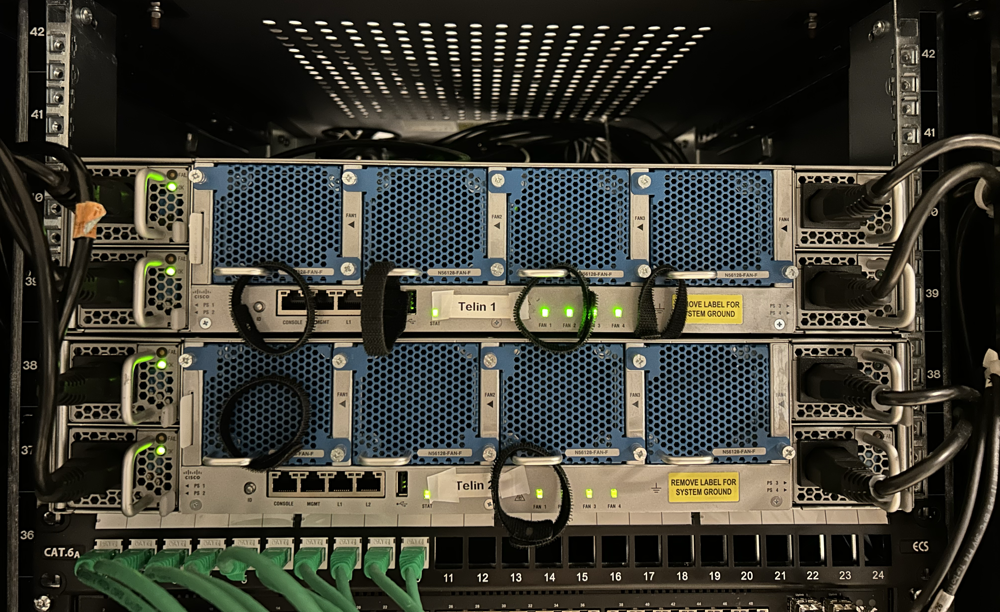
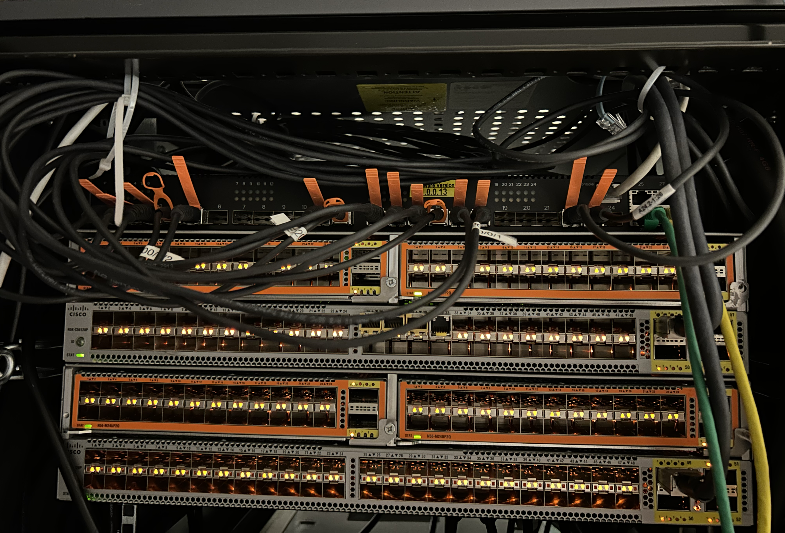

# Rack Switch Identification and Access Log (Quanta & Cisco)

## Overview
This document summarizes all observed details, actions, and findings related to the investigation of switches available in the lab/server room.
We have identified:
1.  A **Quanta LB6M switch (running FASTPATH OS)** positioned at the top of the rack. Console access to this switch has been established (details below). Specific identification details are in `private-network-details.md`.
2.  Two **Cisco Nexus 5600 Series (N5K-C56128P)** switches labeled "Telin 1" and "Telin 2", located below the Quanta switch. These are pending investigation. Specific identification details (if found) should be stored in `private-network-details.md`.

## Switch Images

### Front View


### Back View


## Hardware Details

### Top Switch (Accessed via Console)
- **Vendor**: Quanta Computer Inc.
- **Model**: LB6M
- **Operating System**: FASTPATH (Version details in `private-network-details.md`)
- **Chipset**: Broadcom BCM56820_B0
- **Serial Number**: `<serial-number>` (See `private-network-details.md`)
- **Base MAC Address**: `<mac-address>` (See `private-network-details.md`)
- **Position**: Mounted at the top of the rack above the two Nexus switches.
- **Current Status**: Active with multiple lit SFP ports observed.
- **Connections**: Mixture of fiber and copper connections via SFP modules observed.
- **Console Port**: RJ45 port used with standard "rollover" cable (9600 8N1).
- **Management Port**: Likely a separate RJ45 Ethernet port exists. An IP address (`<ip-address>/<subnet-mask>`) is configured on interface `0/24`, however this port was observed to be **DOWN**. Default gateway also configured (`<gateway-ip>`). (See `private-network-details.md` for IPs).

### Nexus Switches ("Telin 1" & "Telin 2")
- **Vendor**: Cisco
- **Model**: Nexus 5600 Series (N5K-C56128P)
- **Quantity**: 2 units
- **Labels**: "Telin 1" and "Telin 2"
- **Position**: Below the top Quanta switch.
- **Current Status**: Assumed active, pending investigation.

#### Technical Specifications (Nexus 5600 Series):
- **Form Factor**: 1RU (1.75 inches) rack mount
- **Switching Capacity**: Up to 1.28 Tbps
- **Forwarding Rate**: Up to 947 Mpps
- **Ports**:
  - 48 fixed 10-Gigabit SFP+ ports
  - 4 fixed 40-Gigabit QSFP+ ports (or 16 10-Gigabit ports through breakout cables)
  - Management ports: 1 RJ-45 port, 1 RS-232 console port, 1 USB port
- **Key Features**: Layer 2/3, vPC, FCoE, QoS, NX-OS operating system.
- **Console Port**: Standard Cisco RJ45 console port (usually 9600 8N1).
- **Management Port**: Dedicated RJ45 Ethernet port (`mgmt0`).

---

## Connection Attempts and Findings

### 1. Management Port Connection (Attempt via Ethernet Adapter)
- **Equipment Used**:
  - Exibel USB-C to Gigabit Ethernet adapter (AX88179A chipset)
  - Standard Ethernet cable
- **Connection Status**:
  - Successfully connected to *a* management network segment.
  - Received DHCP Address: `<dhcp-ip-address>/<subnet-mask>` (Network details in `private-network-details.md`)
  - Connection active at 1000baseT full-duplex
- **Test Results**:
  - Unable to ping potential switch management IPs (target IPs may have been incorrect).
  - No response to SSH connection attempts.
  - ARP table showed no devices on this management subnet.
- **Conclusion**:
  - Physical connectivity established to a `<network-range>` network.
  - **Relevance Unclear**: It is currently unknown if this network relates to the Quanta switch (which uses a different IP range) or the Cisco Nexus switches. Further investigation needed. (See `private-network-details.md` for network details).

### 2. Console Connection (Successful - Top Quanta LB6M Switch)
- **Equipment Used**:
  - Cisco console cable (light-blue RJ45) connected between server's DB9 serial port (`/dev/ttyS0`) and the Quanta switch's RJ45 console port.
  - Terminal Emulator: `minicom` on Linux server (`<server-hostname>`, see `private-network-details.md`).
- **Connection Status**:
  - Device: `/dev/ttyS0` on the Linux server.
  - Settings: 9600 baud, 8 data bits, no parity, 1 stop bit (8N1).
  - Command: `sudo minicom -D /dev/ttyS0 -b 9600`.
  - Successfully connected, bypassed FASTPATH boot menu, logged in as `<admin-username>` (see `private-network-details.md`), and used `enable` (requires password) to reach privileged mode (`#`).
- **Observed Behavior**:
  - OS identified as FASTPATH (Version details in `private-network-details.md`) on a Quanta LB6M.
  - Standard CLI interaction using `?` for help and `Tab` for completion.
  - **LLDP is currently DISABLED** on all interfaces by default configuration.
  - Ports `0/16`, `0/22`, `0/23` were observed to be **UP** (link active). Other ports 0/1-0/28 were DOWN. Port `0/24` (with configured IP) was DOWN.
  - MAC addresses learned on active ports (Details in `private-network-details.md`). ARP table was empty. No Port Channels active.
- **Challenges**:
  - Initial session required navigating the FASTPATH Startup Menu (selected option 1).
  - Cisco commands are invalid; FASTPATH commands must be used.
- **Conclusion**:
  - Successful console access established to the **top Quanta LB6M switch**.
  - Basic device information, configuration snippets, and current port/protocol status obtained.

### 3. Console Connection Tips for Future Sessions (FASTPATH on Quanta)
For the next console connection attempt to the **Quanta switch**:

- **Proper Screen/Minicom Usage**:
  - Start with `screen /dev/ttyS0 9600` or `sudo minicom -D /dev/ttyS0 -b 9600`.
  - Press Enter 2-3 times to get a prompt (`(FASTPATH Routing) >` or `#`).
  - Use `?` frequently to find commands. Use `Tab` for command completion.
  - To exit screen properly: Press `Ctrl+A`, `Ctrl+\`, then 'y'.
  - To exit minicom: Press `Ctrl+A`, then `X`.

- **Troubleshooting Tips**:
  - If garbage characters appear, verify terminal settings (9600 8N1).
  - If no response, check cable seating and `/dev/ttyS0` permissions (`dialout` group).

- **Logging Console Output**:
  - Use the `script` command before starting screen/minicom:
    ```bash
    script quanta_console_output_$(date +%F).txt
    screen /dev/ttyS0 9600 # or minicom
    ```
    (Type `exit` in the shell after finishing to save the log)
  - Minicom logging: `Ctrl+A`, `L`.

### 4. Useful Quanta FASTPATH Switch Commands (Top Switch)
These commands are relevant for the **Quanta LB6M** switch:

#### Basic Information & Status
- `show version` - Hardware/software versions, MAC, Serial.
- `show sysinfo` - System name, location, uptime.
- `show running-config` - Current active configuration.
- `show lldp interface all` - **Shows Link Status (Up/Down)** and LLDP Tx/Rx status per interface (Note: `show interfaces status` is *not* valid).
- `show interface ethernet <slot/port>` - Shows detailed statistics/counters for a specific physical interface (e.g., `show interface ethernet 0/16`).
- `show interface ethernet switchport` - Shows CPU port statistics.
- `show ip interface brief` / `show ip interface` - IP interface status (May show little if interface is down or unconfigured).
- `show arp` - IP-to-MAC address mappings (ARP cache).
- `show mac-addr-table` - MAC forwarding table (MACs learned per port/VLAN).
- `show vlan` - VLAN summary.
- `show lldp remote-device all` - **Shows LLDP neighbors** (Requires LLDP to be enabled first).
- `show lldp statistics all` - Shows LLDP Tx/Rx counters.
- `show port-channel brief` / `show port-channel all` - Shows status of Link Aggregation groups (Port Channels).
- `show environment` - (**Untested**) Hardware status (temp, fans, power).
- `show logging` / `show eventlog` - (**Untested**) System logs.
- `show clock` - System time.
- `show history` - (**Untested**) Command history.

#### Configuration Commands (Enter `configure` first)
- `lldp run` - Enable LLDP globally.
- `interface <type/number>` (e.g., `interface 0/1`) - Enter interface configuration mode.
  - `lldp transmit` - Enable LLDP sending on this interface.
  - `lldp receive` - Enable LLDP receiving on this interface.
- `hostname <name>` - Set the switch hostname.
- `exit` - Exit current configuration mode.
- `write` - Save running-config to startup-config (run in `#` mode after exiting `configure`).
- `copy <source> <destination>` - File operations.

**(Note:** For the Cisco Nexus switches ("Telin 1", "Telin 2"), standard Cisco NX-OS commands apply.)

---

## Next Steps

1.  **Quanta Switch (Top) - Enable LLDP & Gather More Info**:
    *   Reconnect via console (`/dev/ttyS0`, 9600 baud).
    *   **Enable LLDP**:
        ```
        configure
        lldp run
        ! Apply to relevant interfaces (e.g., the UP ones: 0/16, 0/22, 0/23)
        interface 0/16
        lldp transmit
        lldp receive
        exit
        interface 0/22
        lldp transmit
        lldp receive
        exit
        interface 0/23
        lldp transmit
        lldp receive
        exit
        ! Add other interfaces if needed
        exit
        write 
        ```
    *   Wait ~60 seconds, then check for neighbors: `show lldp remote-device all`. This should identify connected devices like `basefarm-6`.
    *   Get detailed stats for UP ports: `show interface ethernet 0/16`, `show interface ethernet 0/22`, `show interface ethernet 0/23`.
    *   Set a meaningful hostname if not already done (`configure`, `hostname Quanta-Top-SW1`, `exit`, `write`).
    *   Check logs: `show logging`, `show eventlog`.
    *   Check environmentals: `show environment`.
    *   Document findings, especially LLDP neighbor details and interface stats, in `private-network-details.md`.

2.  **Cisco Nexus Switches ("Telin 1" / "Telin 2") - Initial Access**:
    *   Identify console ports on Telin 1 and Telin 2.
    *   Attempt console connection using the same server/cable but connect to the Nexus console port (likely also `/dev/ttyS0` if only one serial port is used, requires moving the cable). Use 9600 8N1 settings.
    *   Attempt management port access (`mgmt0`): Connect laptop/server to the `mgmt0` port, configure an IP on the same subnet (if known), and try SSH/HTTPS. The `<network-range>` network could potentially be for these switches (See `private-network-details.md`).

3.  **Network Clarification**:
    *   Investigate the `<network-range>` network further. Try connecting to it again and scanning for devices (e.g., using `arp-scan` or `nmap` if possible from a connected machine) to see if the Nexus management IPs appear (See `private-network-details.md`).

## Additional Notes
- These are high-performance data center switches commonly used for top-of-rack deployment.
- Support various Layer 2/3 protocols and virtualization features.
- Can be used in a Virtual Port Channel (vPC) setup for redundancy.
- The third switch at the top of the rack appears to be in active production use with multiple connected ports.

---

## Linux Server Connection (to Quanta Console)

### Server Configuration
- **Hardware Connection**:
  - Linux server (`<server-hostname>`, see `private-network-details.md`) connected to the **Top Quanta LB6M** switch console port.
  - Using Cisco console cable (light-blue) with RJ45 connector to switch and DB9 connector to server's serial port (`/dev/ttyS0`).

### Serial Port Details
- **Available Serial Ports**:
  - `/dev/ttyS0` and `/dev/ttyS1` identified on the server
  - Both are 16550A UART hardware
  - Default configuration: 115200 baud (though 9600 baud is standard for Cisco console)
  
### Connection Challenges
- **Access Requirements**:
  - Serial port access requires membership in the `dialout` group on `<server-hostname>`.
  - Terminal emulation software required (screen or minicom)
  - Proper serial settings: 9600 baud, 8 data bits, no parity, 1 stop bit, no flow control
  
### Technical Findings
- Confirmed connection between server (`/dev/ttyS0`) and **Quanta switch console port**.
- Serial ports identified and verified in system logs.
- Standard connection procedure for Quanta console (run on `<server-hostname>`):
  ```bash
  # Ensure user is in the dialout group
  # sudo usermod -a -G dialout $USER
  # Log out and back in if group was just added
  screen /dev/ttyS0 9600
  # OR
  sudo minicom -D /dev/ttyS0 -b 9600
  ```

### Security Considerations
- Console access provides privileged access to switch configuration
- Authentication required at login
- Avoid storing credentials in scripts or logs

### Troubleshooting Details
- **Network Connectivity Issues**:
  - Server (`<server-hostname>`) has limited network connectivity now
  - Package installation fails with connection timeouts to archive.ubuntu.com
  - Consider downloading packages on another system and transferring them

- **Permission Resolution**:
  - Add user to dialout group: `sudo usermod -a -G dialout <username>` (on `<server-hostname>`)
  - Log out and log back in for group changes to take effect
  - Check group membership with: `groups <username>`

- **Serial Connection Debugging**:
  - Check system logs: `dmesg | grep -i ttyS`
  - Verify port existence: `ls -l /dev/ttyS*`
  - Set port parameters: `sudo stty -F /dev/ttyS0 9600 cs8 -cstopb -parenb`
  - Test basic connection: `sudo cat /dev/ttyS0` (expect garbage characters)

### Alternative Connection Methods
- **If screen/minicom can't be installed**:
  - Try direct TTY interaction: `sudo -S stty -F /dev/ttyS0 9600 cs8 -cstopb -parenb raw -echo; sudo cat /dev/ttyS0`
  - Use basic utilities: `echo "show version" | sudo tee /dev/ttyS0 > /dev/null`
  - Script for interactive session:
    ```bash
    #!/bin/bash
    # Save as console.sh and make executable with: chmod +x console.sh
    stty raw -echo
    sudo stty -F /dev/ttyS0 9600 cs8 -cstopb -parenb raw -echo
    sudo cat /dev/ttyS0 & CAT_PID=$!
    while IFS= read -r -n1 char; do
      sudo echo -n "$char" > /dev/ttyS0
    done
    kill $CAT_PID
    stty -raw echo
    ```

### Next Steps (Server & Switch Access)
1.  **Configuration Priorities**:
    *   Verify `<username>` is in `dialout` group on `<server-hostname>`.
    *   Ensure `screen` or `minicom` is available/installed on `<server-hostname>`.
    *   Use `screen` or `minicom` to access the **Quanta** switch console via `/dev/ttyS0`.

2.  **Initial Switch Discovery (Quanta Focus First)**:
    *   Document Quanta's hostname (set one if missing) and IP configuration.
    *   Map physical ports on the Quanta switch using `show lldp interface all` (for link status) and `show mac-addr-table`.
    *   **Enable LLDP** and check neighbors (`show lldp remote-device all`) to confirm connections like `basefarm-6`.

3.  **Documentation Tasks**:
    *   Record successful Quanta connection method and credentials securely (in `private-network-details.md` or password manager).
    *   Save Quanta switch configuration using `write` after changes.
    *   Plan separate documentation for Cisco Nexus switch access/findings.

## Credits
Documented by: Almaz @ UiT Narvik, 2025
